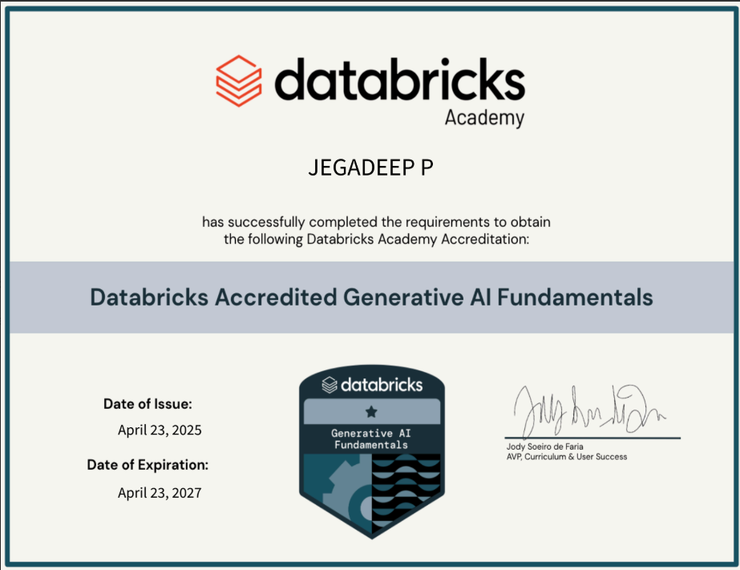
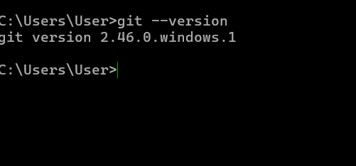
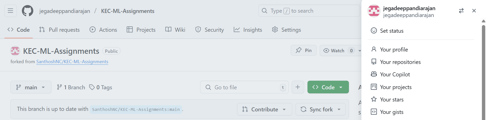
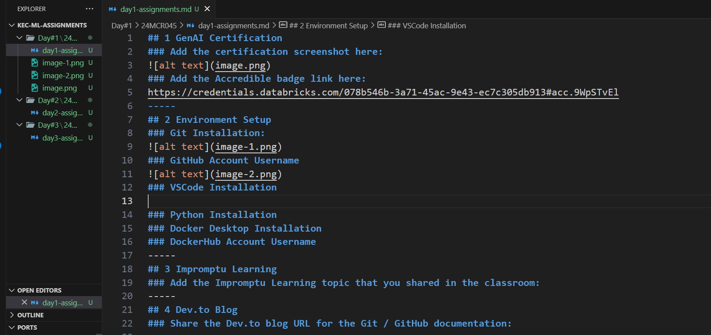
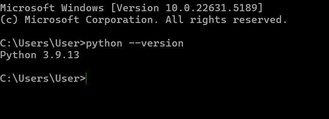
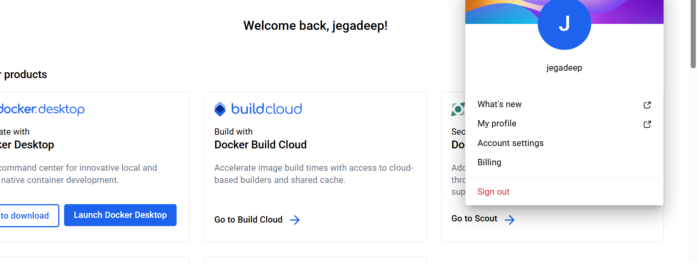
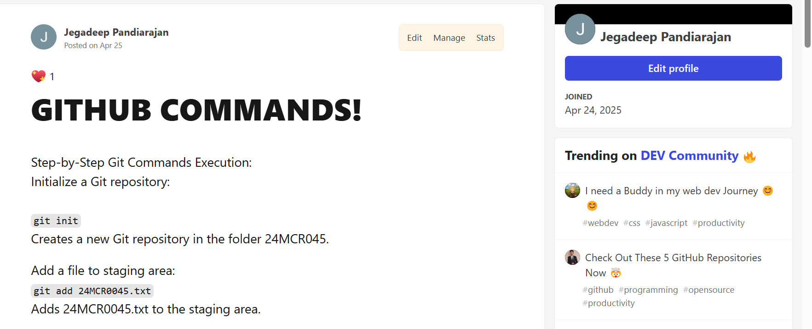

## 1 GenAI Certification
### Add the certification screenshot here:

### Add the Accredible badge link here:
https://credentials.databricks.com/078b546b-3a71-45ac-9e43-ec7c305db913#acc.9WpSTvEl
-----
## 2 Environment Setup
### Git Installation:

### GitHub Account Username

### VSCode Installation

### Python Installation

### Docker Desktop Installation
### DockerHub Account Username
-----
## 3 Impromptu Learning

### Add the Impromptu Learning topic that you shared in the classroom:
-----
## 4 Dev.to Blog

### Share the Dev.to blog URL for the Git / GitHub documentation:
https://dev.to/jegadeep_pandiarajan_253d/github-commands-4ci4
-----
