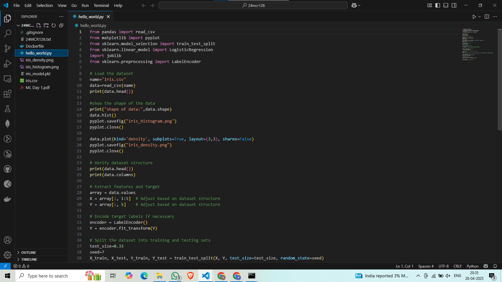

## 1 GenAI Certification
### Add the certification screenshot here:

### Add the Accredible badge link here:
https://credentials.databricks.com/1579e7ab-abdd-4e6f-8dca-96b9f7ca6b69#acc.P08CM1gu

-----
## 2 Environment Setup
### Git Installation:

### GitHub Account Username

### VSCode Installation

### Python Installation

### Docker Desktop Installation

### DockerHub Account Username

## 3 Impromptu Learning
### Add the Impromptu Learning topic that you shared in the classroom:
-----
## 4 Dev.to Blog
### Share the Dev.to blog URL for the Git / GitHub documentation:
https://dev.to/yugeshwaran-gm/step-by-step-git-commands-execution-5am2
-----
