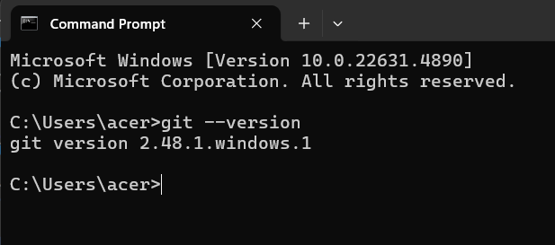
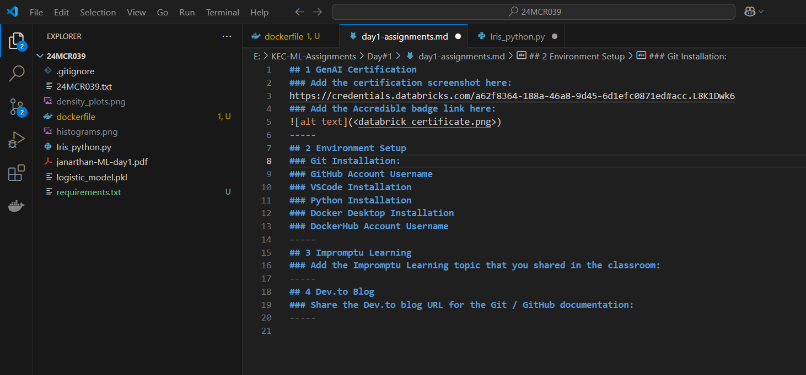
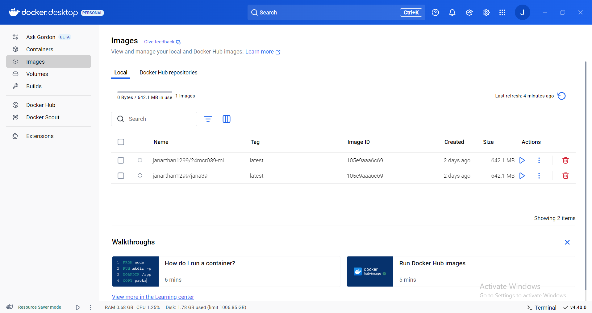

## 1 GenAI Certification
### Add the certification screenshot here:
https://credentials.databricks.com/a62f8364-188a-46a8-9d45-6d1efc0871ed#acc.L8K1Dwk6
### Add the Accredible badge link here:

-----
## 2 Environment Setup
### Git Installation:

### GitHub Account Username
Janarthan1299
### VSCode Installation

### Python Installation

### Docker Desktop Installation

### DockerHub Account Username
janarthan1299
-----
## 3 Impromptu Learning
### Add the Impromptu Learning topic that you shared in the classroom:
-----
## 4 Dev.to Blog
### Share the Dev.to blog URL for the Git / GitHub documentation:
https://dev.to/janarthan_g/day-1-ml-1nd3
-----
