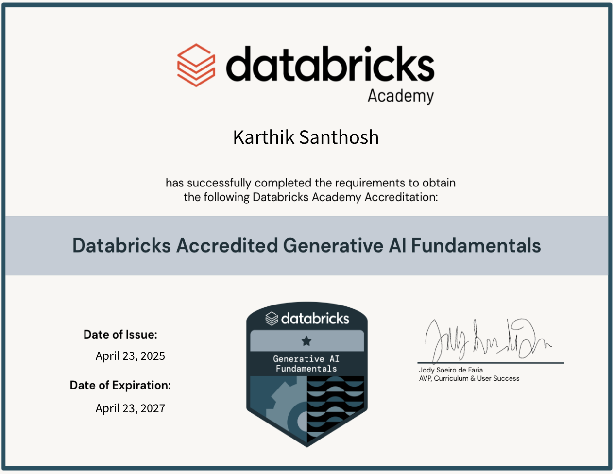

## 1 GenAI Certification
### Add the certification screenshot here:


Certification Screenshot: **Uploaded Successfully**

### Add the Accredible badge link here:
[Accredible Badge Link](https://credentials.databricks.com/c755fd26-e756-4276-9718-0aaa546575d7#acc.PSEF70tk)

-----
## 2 Environment Setup
### Git Installation:
```
brew install git
```
Git installed successfully (Verified with `git --version`).

### GitHub Account Username
**karthikio**

### VSCode Installation
```
brew install --cask visual-studio-code
```

```
code
```
VSCode installed successfully (Verified opening the editor).

### Python Installation
```
brew update
```

```
brew install python
```
Python installed successfully (Verified with `python --version`).

### Docker Desktop Installation
```
brew update
```

```
brew install --cask docker
```

```
docker --version
```
Docker Desktop installed successfully (Verified Docker is running).

### DockerHub Account Username
**karthikio**

-----
## 3 Impromptu Learning
### Add the Impromptu Learning topic that you shared in the classroom:
ML Model Training Explained With Practical
**Understanding Git Internals: How Git Tracks Changes at the Backend**

-----
## 4 Dev.to Blog
### Share the Dev.to blog URL for the Git / GitHub documentation:
[My Dev.to Blog on Git and GitHub](https://dev.to/karthikio/step-by-step-git-commands-for-first-time-repo-setup-with-github-42ik)

-----

