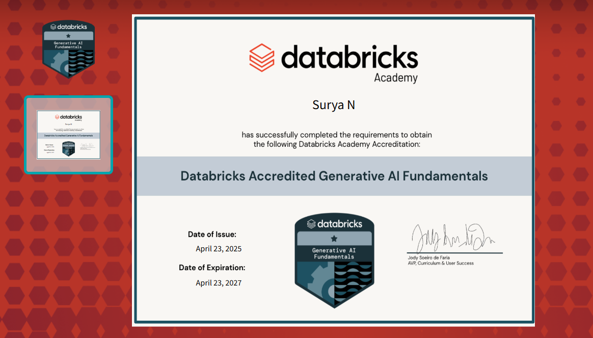
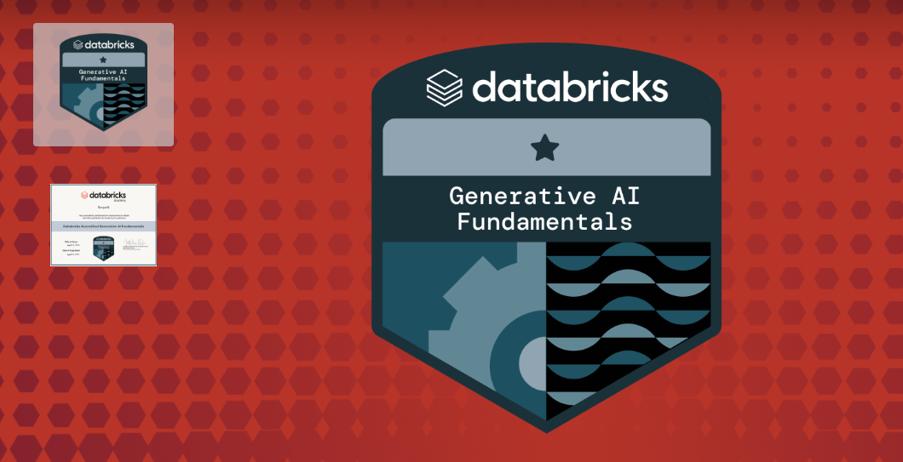

# 📚 Day 1 Assignment

## 1. 🎯 GenAI Certification

- 📜 **Generative AI Fundamentals Certificate**  
  

- 🏅 **Generative AI Fundamentals Badge**  
  

---

## 2. 🛠️ Environment Setup

- ✅ **Git Installation**
- 👤 **GitHub Account Username**: `Surya-2k4`
- ✅ **VSCode Installation**
- ✅ **Python Installation**
- ✅ **Docker Desktop Installation**
- 👤 **DockerHub Account Username**: `surya2k42`

---

## 3. 📝 Dev.to Blog

- 🔗 [Getting Started with Git and GitHub — A Hands-on Guide](https://dev.to/surya_cca7c59900971f19c9b/getting-started-with-git-and-github-a-hands-on-guide-3akd)

---
