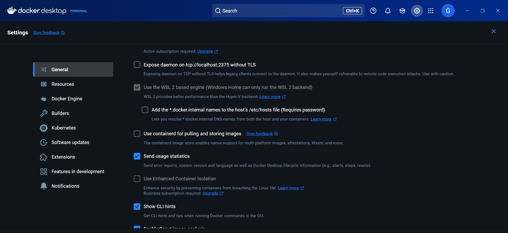

## 1 GenAI Certification
### Add the certification screenshot here: 
### Add the Accredible badge link here: https://api.accredible.com/v1/frontend/credential_website_embed_image/badge/140855379
-----
## 2 Environment Setup
### Git Installation: 
### GitHub Account Username  selva192003
### VSCode Installation 
### Python Installation  
### Docker Desktop Installation  
### DockerHub Account Username selva192003
-----
## 3 Impromptu Learning
### Add the Impromptu Learning topic that you shared in the classroom:
-----
## 4 Dev.to Blog
### Share the Dev.to blog URL for the Git / GitHub documentation: https://dev.to/selva_j/github-commands-d2o
-----
