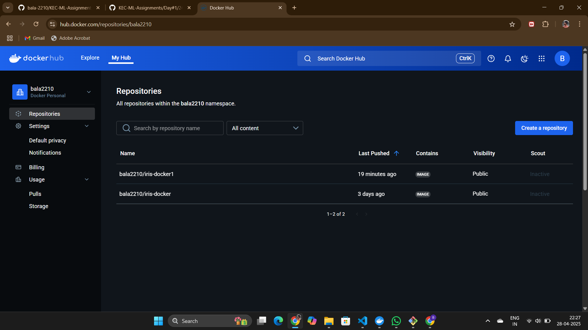
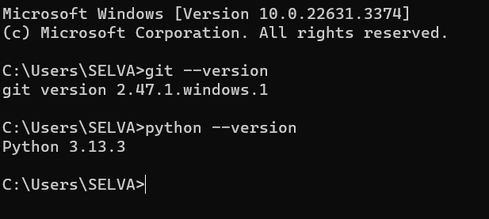
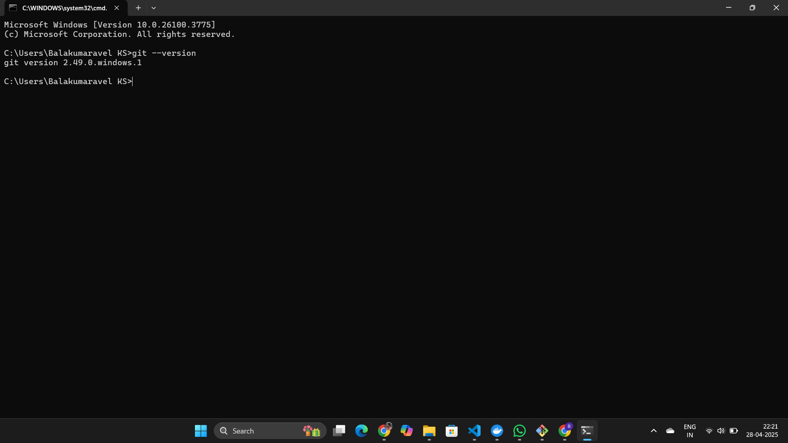

## 1 GenAI Certification
### Add the certification screenshot here:

### Add the Accredible badge link here:
https://api.accredible.com/v1/auth/invite?code=88b6e85833ee5c10d968&credential_id=2bdb0853-d7f9-4d13-a701-63abb0e6691f&url=https%3A%2F%2Fcredentials.databricks.com%2F2bdb0853-d7f9-4d13-a701-63abb0e6691f&ident=ea802867-1177-4320-a8f3-dff18a5c156e
-----
## 2 Environment Setup
### Git Installation:

### GitHub Account Username

### VSCode Installation

### Python Installation

### Docker Desktop Installation

### DockerHub Account Username

-----
## 3 Impromptu Learning
### Add the Impromptu Learning topic that you shared in the classroom:
Machine Learning
-----
## 4 Dev.to Blog
### Share the Dev.to blog URL for the Git / GitHub documentation:
https://dev.to/thanusri7012/github-repository-setup-9d3
-----
