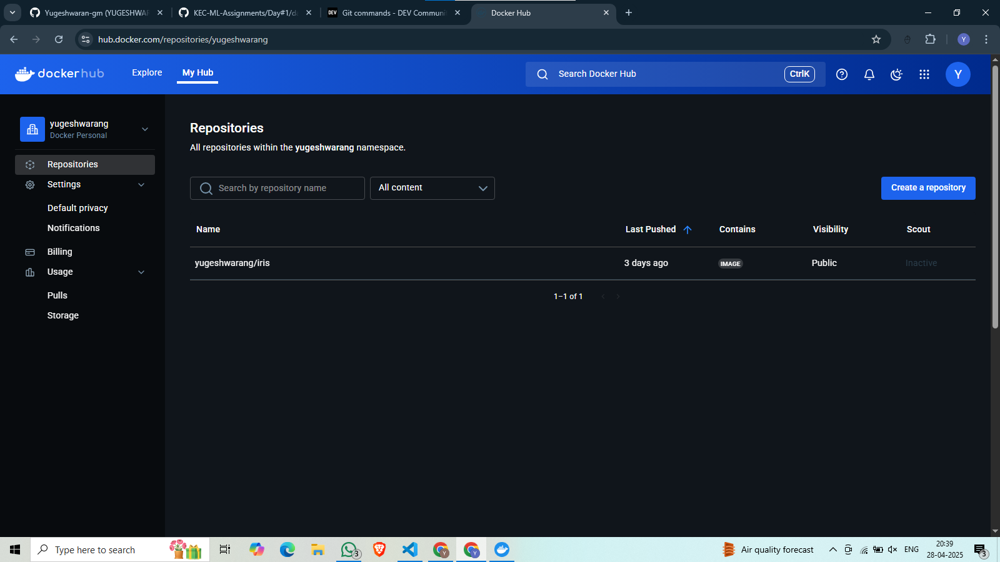
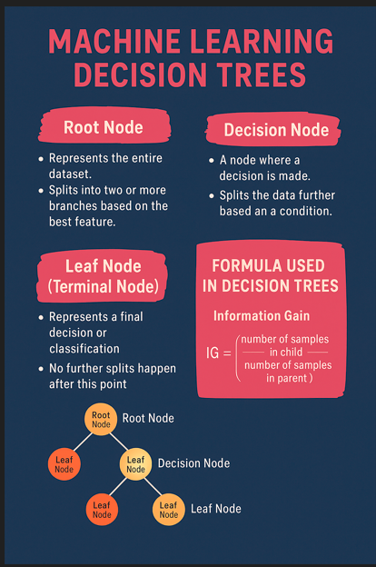

## 1 Advanced Git commands 
###  Write it in dev.to blog / Share the Dev.to blog URL for the Git / GitHub documentation:
https://dev.to/yugeshwaran-gm/git-commands-3n2l
-----
## 2 Docker Image creation and pushing to DockerHub
###  Write the steps and commands in dev.to blog

-----
## 3 Poster Creation
###  Pls use the topics from Unit #3
Decisin Tree
###  Paste the poster in this Repo

-----
## 4 Create a new branch and add the Dockerfile
###  all the code should be in the same repo but with different branch name. Add the repo URL
https://github.com/Yugeshwaran-gm/24MCR126/tree/feature-24MCR126
###  Mention the branch name here

docker_file
-----
