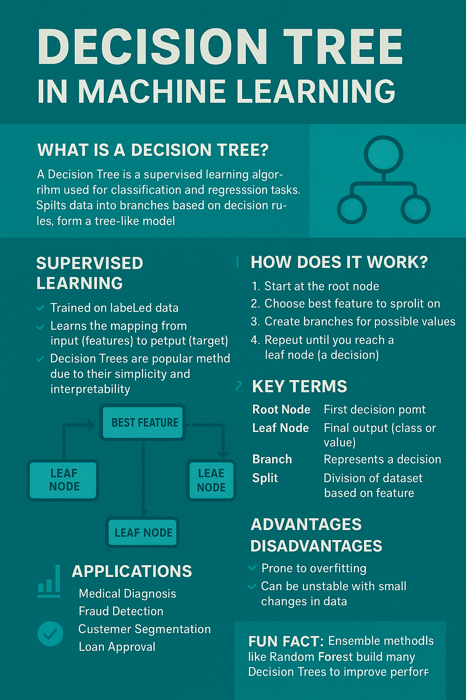

## 1 Advanced Git commands 
###  Write it in dev.to blog / Share the Dev.to blog URL for the Git / GitHub documentation:
https://dev.to/thanusri7012/advanced-git-commands-1m3m
-----
## 2 Docker Image creation and pushing to DockerHub
###  Write the steps and commands in dev.to blog
https://dev.to/thanusri7012/dockerize-a-python-ml-model-49mk
-----
## 3 Poster Creation
###  Pls use the topics from Unit #3
###  Paste the poster in this Repo

-----
## 4 Create a new branch and add the Dockerfile
###  all the code should be in the same repo but with different branch name. Add the repo URL
###  Mention the branch name here
https://dev.to/thanusri7012/creating-a-new-branch-and-adding-the-dockerfile-4cjh
( Branch name :feature1)
-----
