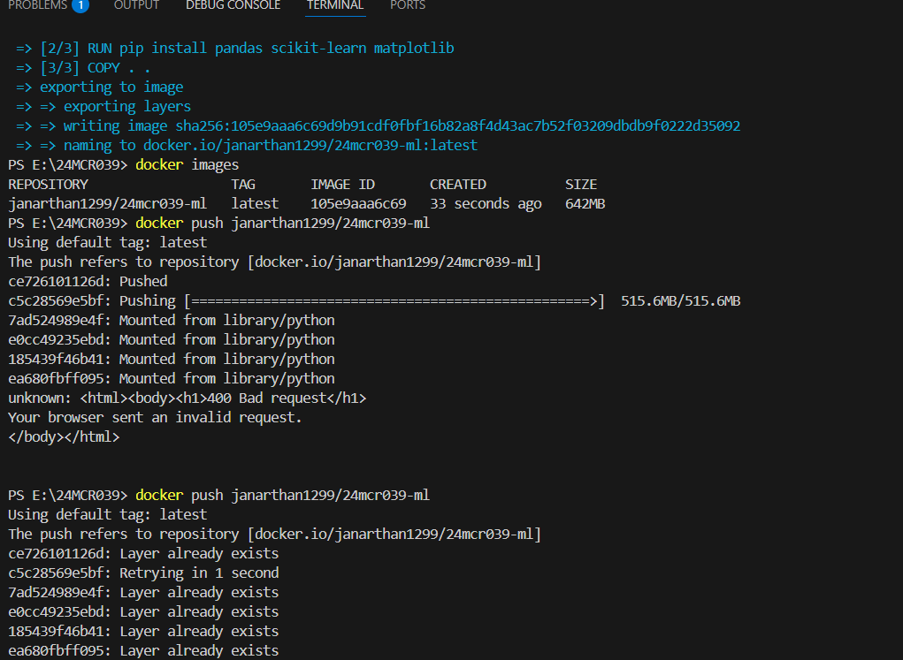

## 1 Advanced Git commands 
###  Write it in dev.to blog / Share the Dev.to blog URL for the Git / GitHub documentation:
https://dev.to/janarthan_g/about-day-2-4bal
-----
## 2 Docker Image creation and pushing to DockerHub
###  Write the steps and commands in dev.to blog

-----
## 3 Poster Creation
###  Pls use the topics from Unit #3
###  Paste the poster in this Repo

-----
## 4 Create a new branch and add the Dockerfile
###  all the code should be in the same repo but with different branch name. Add the repo URL
###  Mention the branch name here
https://github.com/Janarthan1299/24MCR039/tree/feature-24MCR039
-----
