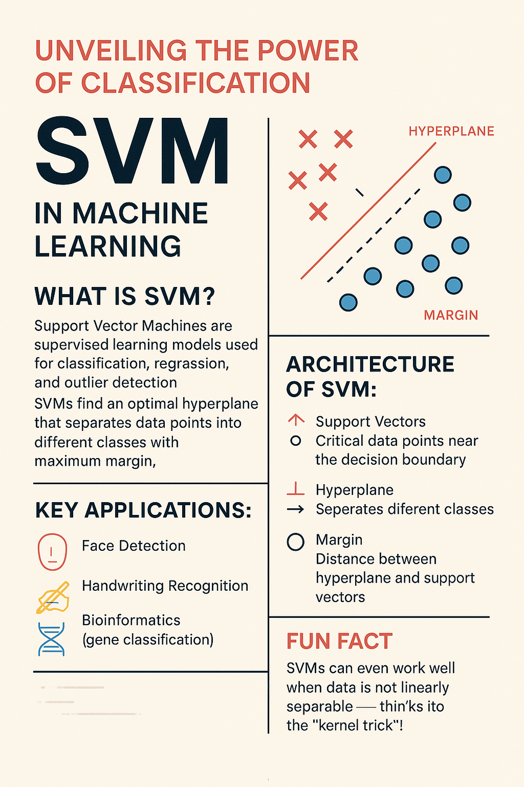

## 1 Advanced Git commands 
### Write it in Dev.to blog / Share the Dev.to blog URL for the Git / GitHub documentation:
[My Dev.to Blog on Advanced Git Commands](https://dev.to/karthikio/level-up-with-these-10-useful-git-commands-o2b)

-----
## 2 Docker Image creation and pushing to DockerHub
### Write the steps and commands in Dev.to blog:
[My Dev.to Blog on Docker Image Creation and Push](https://dev.to/karthikio/how-to-create-a-docker-image-and-push-it-to-dockerhub-5476)

-----
## 3 Poster Creation
### Use the topics from Unit #3

Poster uploaded successfully inside `images/` folder.

-----
## 4 Create a new branch and add the Dockerfile
### All the code should be in the same repo but with a different branch name.
- **Repository URL:** [GitHub Repo Link](https://github.com/karthikio/24MCR050/tree/dockerfile-branch)
- **Branch Name:** `dockerfile-branch`

Dockerfile and related code added successfully in the above branch.

-----
