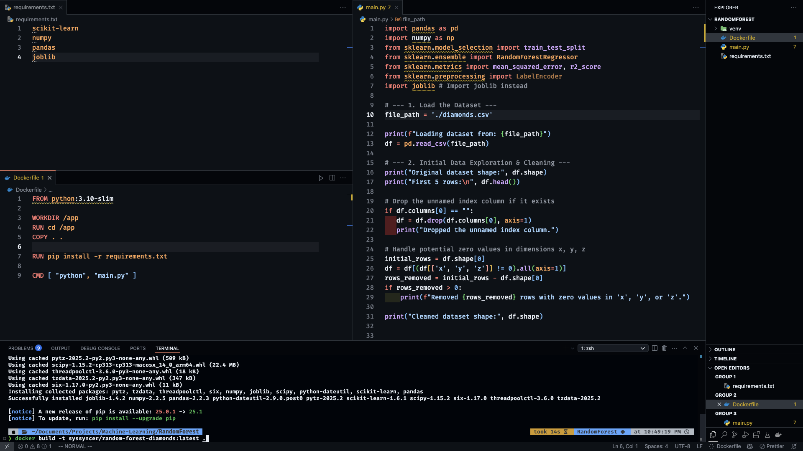
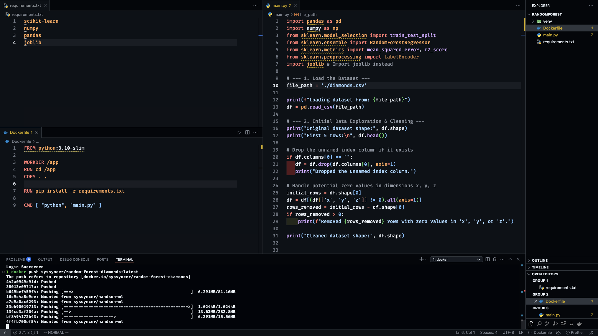
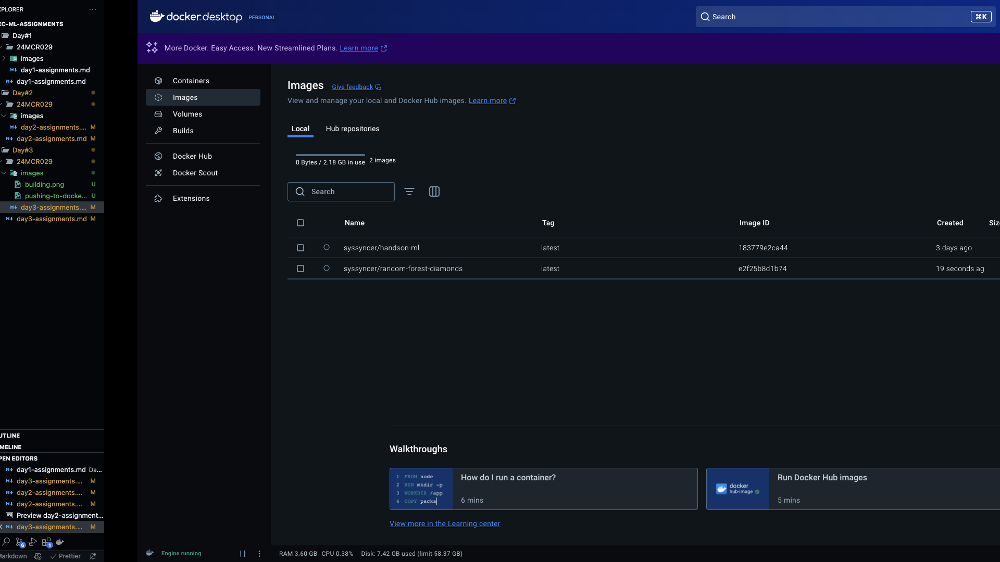
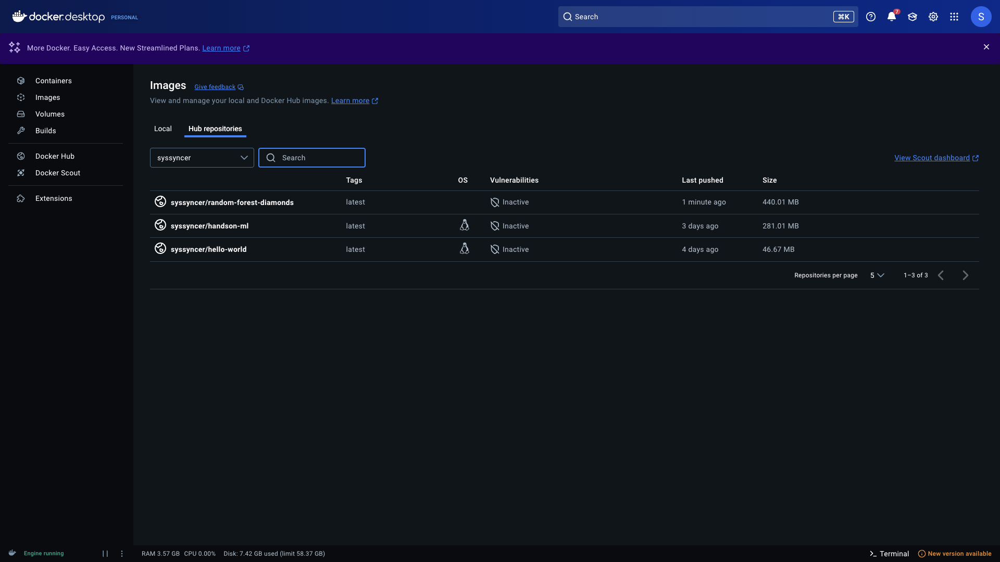

## 1 Pick any one of the algorithm from the units 3 / 4 / 5

### Enter the choosen algorithm : Random Forest

### Create a docker image for the same and push the same to dockerhub.

### Added the screenshots here

---

#### Building docker image

   

---

#### Pushing image to docker hub

   

---

## Docker and Docker-hub

---

#### docker image in local

   

---

#### docker image in docker-hub

   
