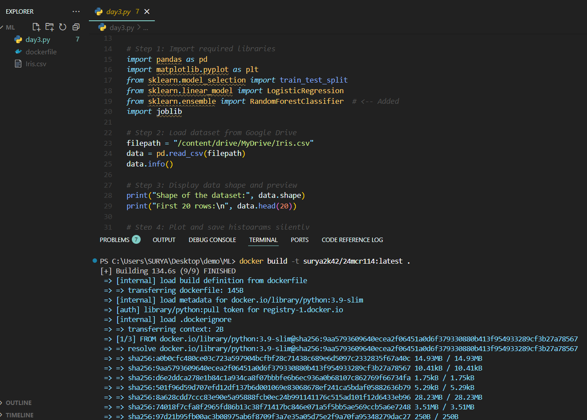
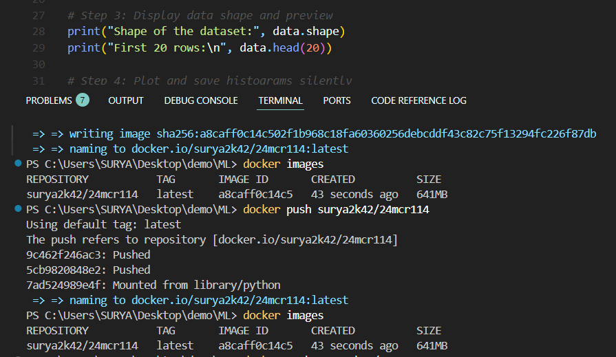
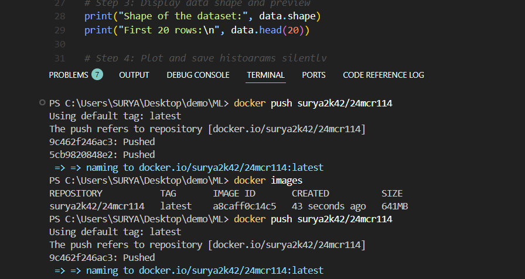
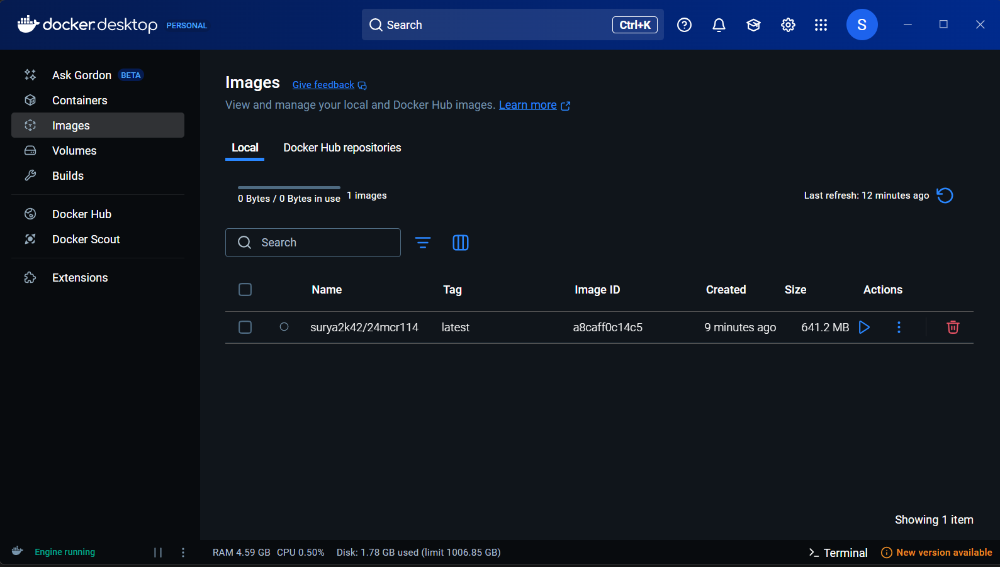

# 📚 Day 3 Assignment

## 1. Chosen Algorithms
- ✅ Logistic Regression
- ✅ Random Forest

## 2. Docker Images Built and Pushed

The following Docker images were successfully built and pushed:

- 📦 **Docker build**
  
  

- 📦 **Docker images**
  
  

- 📦 **Dcoker push **
  
  

  

  - 📦 **Docker Dashboard**

  
