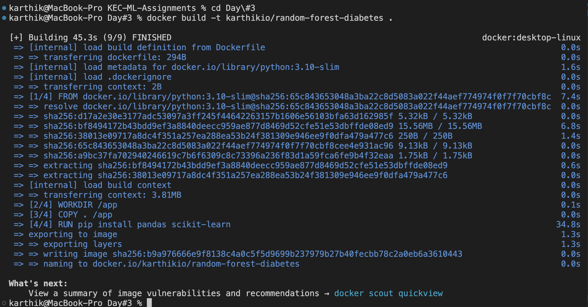
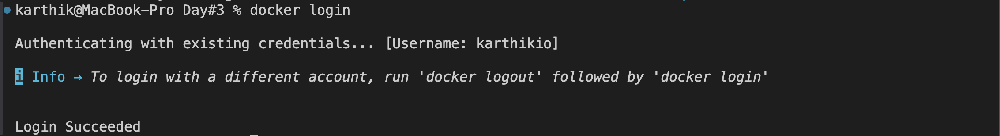
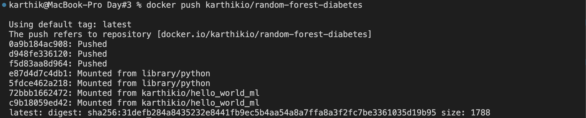

## 1 Pick any one of the algorithm from the units 3 / 4 / 5
###  Enter the choosen algorithm
**Random Forest**
###  Create a docker image for the same and push the same to dockerhub.
- **DockerHub Image Name:** `karthikio/random-forest-diabetes`
- **Docker Image Status:** Successfully created and pushed!
###  Add the screenshots here

-----

-----
