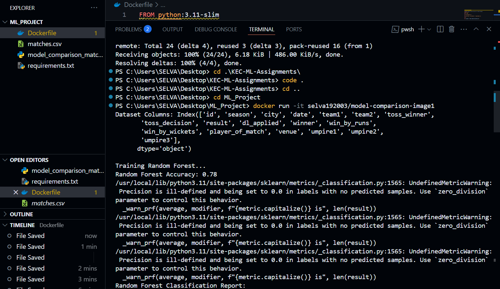

## 1 Pick any one of the algorithm from the units 3 / 4 / 5
###  Enter the choosen algorithm  Random Forest, Decision Tree, Logistic Regression
###  Create a docker image for the same and push the same to dockerhub. 
###  Add the screenshots here

