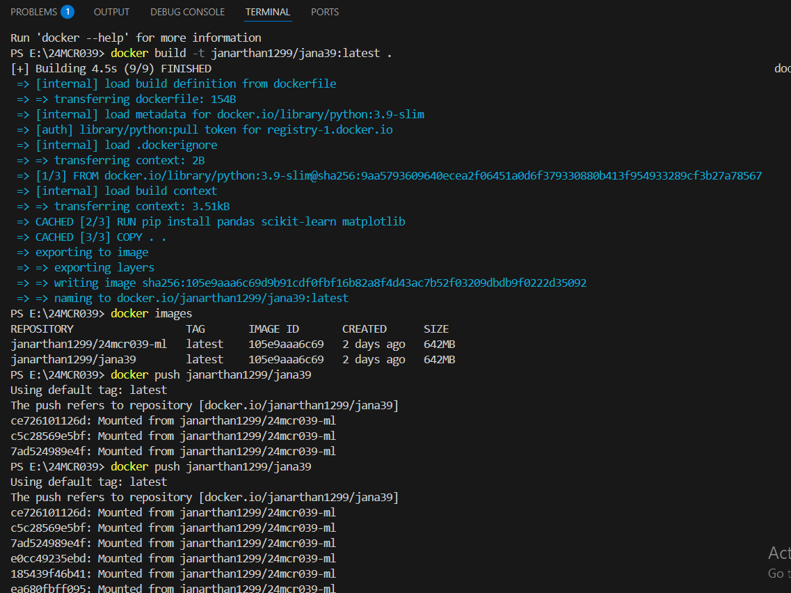

## 1 Pick any one of the algorithm from the units 3 / 4 / 5

###  Enter the choosen algorithm
Linear Regression
###  Create a docker image for the same and push the same to dockerhub.

###  Add the screenshots here

